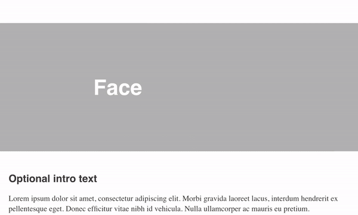

# Progressive image load

[](https://www.npmjs.com/package/progressive-image-load) 


`npm install progressive-image-load`

#### JS

* Import js
```
import ProgressiveImageLoad from 'progressive-image-load';

ProgressiveImageLoad();
```

* HTML
```
<script>
    ProgressiveImageLoad();
</script>
```

#### HTML

```
<section class="blur-image-load" data-large="big-image.jpg">
    
    <div style="padding-bottom:66,7%"></div>
</section>
```


